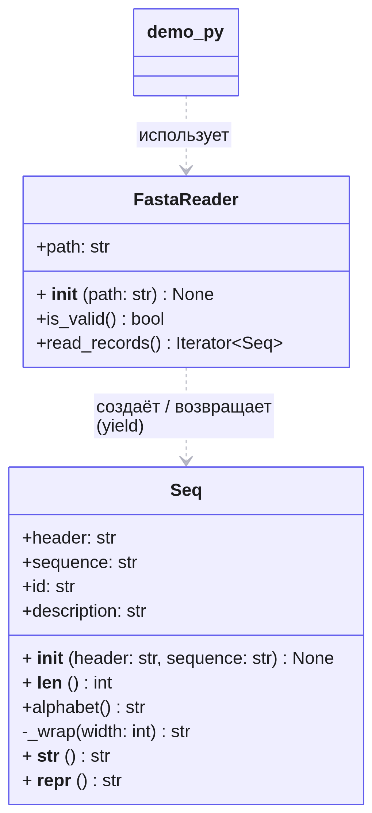

# FASTA Project

Проект для чтения и обработки биологических последовательностей в формате FASTA.

### Описание

Проект содержит классы для чтения FASTA-файлов и представления биологических последовательностей.

Основные классы:

* `Seq` — представляет биологическую последовательность, определяет её длину и тип алфавита.
* `FastaReader` — читает FASTA-файлы и создаёт объекты `Seq`.

В репозитории также есть:
- демонстрационная программа `demo.py`;
- HTML-документация, собранная через Sphinx;
- UML-диаграмма классов.
- пример вывода программы 'example'


### Установка

Клонируйте репозиторий:

```bash
git clone https://github.com/DariyaAsylkozhaeva/fasta_project.git
cd fasta_project
```


### Запуск

Для запуска основной программы выполните:

```bash
python demo.py
```

Программа читает FASTA-файлы.

Для каждой последовательности программа выводит:

* FASTA-запись;
* длину последовательности;
* тип последовательности;

### Документация

Документация проекта создана с помощью Sphinx.

HTML-документация находится в docs/_build/html/fasta_toolkit.html


### Структура проекта

```fasta_project/
├── fasta_toolkit.py     # классы Seq и FastaReader
├── demo.py              # демонстрационная программа
├── example              # пример вывода программы
├── docs/                # HTML-документация Sphinx
└── uml/                 # UML-диаграмма классов
```

### UML

### UML-диаграмма классов

UML-диаграмма классов проекта находится в директории `uml`.



### Версия

**1.0.0**


